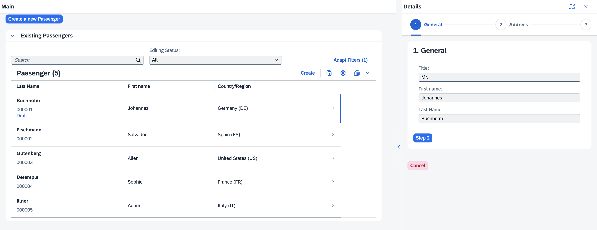

# Devtoberfest 2023

This repository contains the final result of the Devtoberfest 2023 session ["SAP Fiori elements and SAP Fiori tools: It's time to use TypeScript!"](https://groups.community.sap.com/t5/devtoberfest/sap-fiori-elements-and-sap-fiori-tools-it-s-time-to-use-typescript/ev-p/283518). Expect that there are small differences between this repository and the application built in the demo, as this reference was created beforehand.

The OData Service is a variation of [cap-sflight](https://github.com/SAP-samples/cap-sflight).

Note that this is only published for you to revisit the technical details of the demo. The existence of this repository does not promise any current or future functionality. While everything worked great in the demo, it might also no longer work -- if you are still interested to fix this, feel free to open an issue and we can investigate this together.

## Setup

- If using a local installation of Visual Studio Code, make sure that you have the [SAP Fiori tools](https://marketplace.visualstudio.com/items?itemName=SAPSE.sap-ux-fiori-tools-extension-pack) installed; this should already be there in the SAP Business Application Studio
- Make sure to have `@sap/cds-dk` installed globally: `npm install -g @sap/cds-dk`
- Install dependencies for the application: `npm install`
- Open this repository in the SAP Business Application Studio or Visual Studio Code and start exploring the project using SAP Fiori tools
